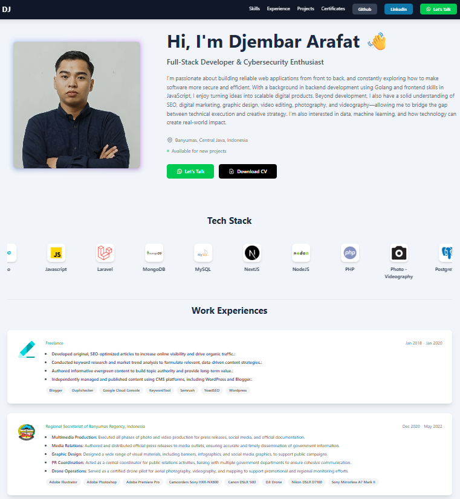

# Portofolio Pribadi - Djembar Arafat


Sebuah website portofolio full-stack yang dibangun dari nol untuk menampilkan keahlian, pengalaman kerja, proyek, dan sertifikasi saya dalam pengembangan web dan bidang kreatif lainnya.

[🚀 **Lihat Live Demo**](https://URL_VERCEL_ANDA.vercel.app)
_(Jangan lupa ganti `URL_VERCEL_ANDA.vercel.app` dengan link Vercel Anda yang sebenarnya setelah deployment berhasil)_

---


_(Catatan: Pastikan Anda memiliki folder `screenshot` di root proyek dan di dalamnya ada file `ssweb.png`)_

### ✨ Fitur Utama

- **Desain Responsif dengan Dark Mode:** Tampilan yang adaptif di semua perangkat, lengkap dengan toggle tema terang dan gelap.
- **Data Dinamis:** Semua konten (Skills, Experience, Projects, Certificates) diambil secara _real-time_ dari database **PostgreSQL** (via Supabase) menggunakan **API** yang dibangun sendiri.
- **Backend API Sendiri:** Dibuat dengan **Node.js** dan **Express.js** untuk mengelola permintaan data dari frontend.
- **Interaktivitas Modern:**
  - Slider "Marquee" untuk Skills yang berjalan otomatis menggunakan **Swiper.js**.
  - **Filter Kategori** Proyek secara live tanpa reload halaman.
  - **Pagination** untuk bagian Proyek, Pengalaman, dan Sertifikat agar tampilan tetap rapi.
  - **Modal Pop-up** untuk menampilkan detail proyek dan gambar sertifikat dengan jelas.

### 🛠️ Tumpukan Teknologi (Tech Stack)

- **Frontend:**
  - React (Vite)
  - Tailwind CSS
  - Swiper.js
  - Axios
- **Backend:**
  - Node.js
  - Express.js
- **Database:**
  - PostgreSQL (dikelola oleh Supabase)
- **Deployment:**
  - Vercel

### ⚙️ Instalasi & Setup Lokal

Untuk menjalankan proyek ini di komputer lokal Anda:

1.  **Clone repository ini:**

    ```bash
    git clone [https://github.com/djembaraa/profile.git](https://github.com/djembaraa/profile.git)
    cd profile
    ```

2.  **Setup Backend:**

    ```bash
    cd backend
    npm install
    ```

3.  **Setup Frontend:**

    ```bash
    cd ../frontend
    npm install
    ```

4.  **Konfigurasi Environment Variables:**

    - Buat file `.env` di dalam folder `backend`.
    - Tambahkan variabel berikut sesuai dengan akun Supabase Anda:
      ```
      SUPABASE_URL=URL_PROYEK_SUPABASE_ANDA
      SUPABASE_SERVICE_KEY=KUNCI_SERVICE_ROLE_ANDA
      ```

5.  **Menjalankan Proyek:**
    - Anda membutuhkan **dua terminal** yang berjalan bersamaan.
    - **Terminal 1 (dari folder root, `profile`):** Jalankan server backend.
      ```bash
      npm start
      ```
    - **Terminal 2 (dari folder `frontend`):** Jalankan server frontend.
      ```bash
      cd frontend
      npm run dev
      ```
    - Buka `http://localhost:5173` (atau port lain yang ditampilkan) di browser Anda.

### 📁 Struktur Proyek

Proyek ini menggunakan struktur _monorepo-style_, di mana kode backend dan frontend berada dalam satu repository utama tetapi dipisahkan dalam folder masing-masing.
